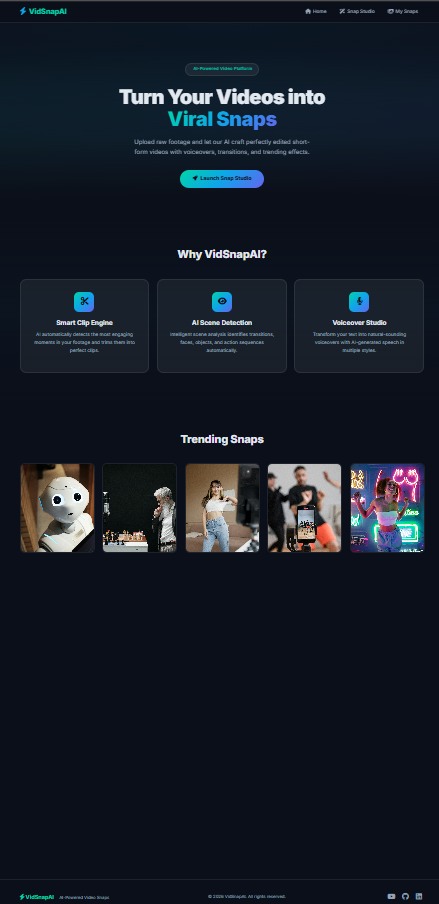
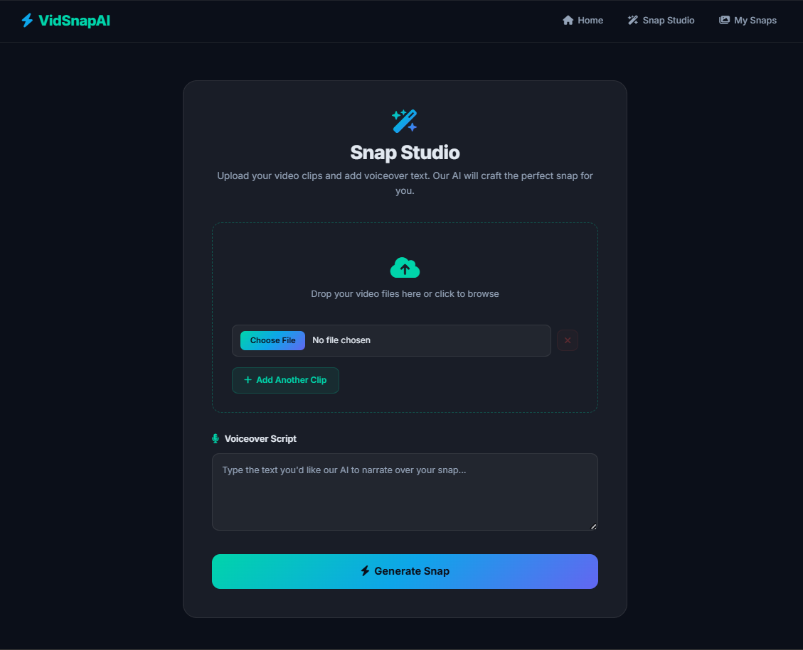
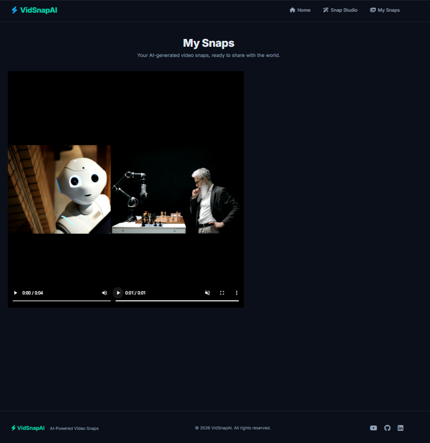

<p align="center">
  
  
  
  
  
</p>

<h1 align="center">⚡ VidSnapAI</h1>
<h3 align="center">AI-Powered Short-Form Video Generator</h3>
<p align="center">
  <em>Upload raw footage → Add a voiceover script → Get a polished, reel-ready video in seconds.</em>
</p>

---

## 📌 Table of Contents

- [Overview](#-overview)
- [Features](#-features)
- [Tech Stack](#-tech-stack)
- [Project Structure](#-project-structure)
- [Getting Started](#-getting-started)
- [Usage](#-usage)
- [Screenshots](#-screenshots)
- [Architecture](#-architecture)
- [Contributing](#-contributing)
- [License](#-license)

---

## 🧠 Overview

**VidSnapAI** is a web-based AI video editing platform that transforms raw video clips and images into polished, short-form vertical videos (reels/shorts). Users upload their media, provide an optional voiceover script, and the platform automatically:

- Generates natural-sounding AI voiceovers using **ElevenLabs Text-to-Speech**
- Stitches media together in vertical (1080×1920) format using **FFmpeg**
- Serves the finished reels in a sleek gallery for instant preview and sharing

The entire pipeline is powered by a Flask backend with a background processing queue, making it fast and scalable.

---

## ✨ Features

| Feature | Description |
|---|---|
| 🎬 **Snap Studio** | Intuitive drag-and-drop interface to upload multiple video clips and images |
| 🎙️ **AI Voiceover** | Natural-sounding text-to-speech narration powered by ElevenLabs |
| 🎞️ **Auto Video Processing** | Automatic video stitching, scaling, and formatting to vertical 1080×1920 |
| 📱 **Reel-Ready Output** | Videos are optimized for Instagram Reels, YouTube Shorts, and TikTok |
| 🖼️ **Snap Gallery** | Browse and preview all your generated video snaps in one place |
| ⏳ **Background Processing** | Asynchronous queue-based processing — upload and come back later |
| 🌐 **Responsive UI** | Modern, mobile-friendly interface built with Bootstrap 5 |

---

## 🛠️ Tech Stack

| Layer | Technology |
|---|---|
| **Backend** | Python 3.10+, Flask |
| **Frontend** | HTML5, CSS3, Bootstrap 5, Font Awesome 6 |
| **AI / TTS** | ElevenLabs Text-to-Speech API (Turbo v2.5) |
| **Video Processing** | FFmpeg (libx264, AAC) |
| **Fonts** | Google Fonts (Inter) |

---

## 📁 Project Structure

```
VidSnapAI/
├── main.py                  # Flask application & route definitions
├── config.py                # Environment variable loader (API keys)
├── generate_process.py      # Background worker: TTS + FFmpeg pipeline
├── text_to_audio.py         # ElevenLabs TTS integration module
├── .env                     # Environment variables (API keys — not tracked)
├── requirements.txt         # Python dependencies
│
├── templates/
│   ├── base.html            # Base template with navbar & footer
│   ├── index.html           # Landing page (hero, features, showcase)
│   ├── create.html          # Snap Studio (upload & voiceover form)
│   └── gallery.html         # Generated snaps gallery
│
├── static/
│   ├── css/
│   │   ├── style.css        # Global styles & landing page
│   │   ├── create.css       # Snap Studio page styles
│   │   └── gallery.css      # Gallery page styles
│   ├── reels/               # Generated output videos
│   └── *.jpg                # Showcase/demo images
│
└── user_uploads/            # Temporary upload storage (not tracked)
```

---

## 🚀 Getting Started

### Prerequisites

- **Python 3.10+** — [Download](https://www.python.org/downloads/)
- **FFmpeg** — [Download](https://ffmpeg.org/download.html) (must be added to system PATH)
- **ElevenLabs API Key** — [Get one free](https://elevenlabs.io/)

### Installation

1. **Clone the repository**
   ```bash
   git clone https://github.com/Vignesh-Salian/VidSnapAI.git
   cd VidSnapAI
   ```

2. **Create a virtual environment**
   ```bash
   python -m venv .venv
   source .venv/bin/activate        # Linux/macOS
   .venv\Scripts\activate           # Windows
   ```

3. **Install dependencies**
   ```bash
   pip install -r requirements.txt
   ```

4. **Set up your environment variables**

   Create a `.env` file in the project root:
   ```env
   ELEVENLABS_API_KEY=your_api_key_here
   ```

5. **Run the application**

   You need to start **two processes** in separate terminals:

   ```bash
   # Terminal 1: Start the Flask web server
   python main.py

   # Terminal 2: Start the background video processor
   python generate_process.py
   ```

6. **Open your browser** and navigate to `http://127.0.0.1:5000`

---

## 🎯 Usage

### 1. Landing Page
Visit the home page to explore features and see trending sample snaps.

### 2. Snap Studio (`/studio`)
- Click **"Launch Snap Studio"** from the landing page
- Upload one or more video clips or images
- *(Optional)* Write a voiceover script in the text area
- Click **"Generate Snap"** to submit

### 3. Processing
The background worker (`generate_process.py`) automatically:
1. Detects new uploads in the queue
2. Converts the voiceover text to speech via ElevenLabs
3. Stitches all media into a vertical video with FFmpeg
4. Saves the final reel to `static/reels/`

### 4. My Snaps (`/snaps`)
Browse all your generated video snaps in a beautiful gallery view.

---

## 📸 Screenshots





---

## 🏗️ Architecture

```
┌─────────────────┐     ┌──────────────────┐     ┌────────────────┐
│   Browser UI    │────▶│  Flask Server    │────▶│  user_uploads/ │
│  (Bootstrap 5)  │     │  (main.py)       │     │  (raw media)   │
└─────────────────┘     └──────────────────┘     └───────┬────────┘
                                                         │
                              ┌───────────────────────────┘
                              ▼
                 ┌────────────────────────┐
                 │  Background Worker     │
                 │  (generate_process.py) │
                 └──────┬─────────┬───────┘
                        │         │
                        ▼         ▼
              ┌──────────┐  ┌──────────┐
              │ElevenLabs│  │  FFmpeg   │
              │  TTS API │  │ (Video)   │
              └────┬─────┘  └────┬─────┘
                   │             │
                   └──────┬──────┘
                          ▼
                 ┌────────────────┐
                 │  static/reels/ │
                 │ (final videos) │
                 └────────────────┘
```

**Flow:**
1. User uploads media + voiceover text via the **Snap Studio** interface
2. Flask saves files to `user_uploads/<uuid>/`
3. The **background worker** polls for new folders every 4 seconds
4. If voiceover text exists → calls **ElevenLabs API** for TTS audio
5. **FFmpeg** stitches media + audio into a vertical 1080×1920 MP4
6. Final reel is saved to `static/reels/` and displayed in the **Gallery**

---

## 🤝 Contributing

Contributions are welcome! Here's how to get started:

1. **Fork** the repository
2. **Create** a feature branch (`git checkout -b feature/amazing-feature`)
3. **Commit** your changes (`git commit -m 'Add amazing feature'`)
4. **Push** to the branch (`git push origin feature/amazing-feature`)
5. **Open** a Pull Request

---

## 📄 License

This project is licensed under the **MIT License** — see the [LICENSE](LICENSE) file for details.

---

## 👨‍💻 Author

<table>
  <tr>
    <td align="center">
      <a href="https://github.com/VIGNESH-SALIAN">
        
      </a>
      
      <br />
      <a href="https://github.com/VIGNESH-SALIAN">
        
      </a>
    </td>
  </tr>
</table>

---

<p align="center">
  
  
  
  
  
  
  
  
</p>
